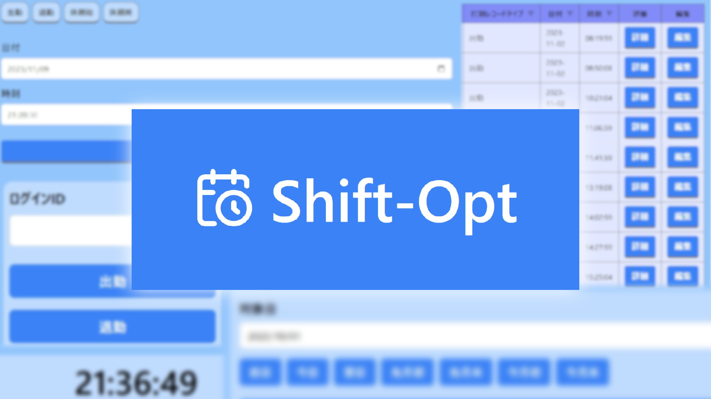

    

## Shift-Opt とは

Shift-Optは、勤怠管理システムです。
時給制スタッフを雇用する会社の利用をイメージして製作しました。

- [Simple, fast routing engine](https://laravel.com/docs/routing).
- [Powerful dependency injection container](https://laravel.com/docs/container).
- Multiple back-ends for [session](https://laravel.com/docs/session) and [cache](https://laravel.com/docs/cache) storage.
- Expressive, intuitive [database ORM](https://laravel.com/docs/eloquent).
- Database agnostic [schema migrations](https://laravel.com/docs/migrations).
- [Robust background job processing](https://laravel.com/docs/queues).
- [Real-time event broadcasting](https://laravel.com/docs/broadcasting).

是非、ポートフォリオをご覧ください。

    <a href="https://gce.shift-opt.com">ポートフォリオを見る</a>

